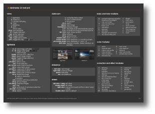

# darktable-refcard
A reference card for the darktable 2.0 photography workflow application.

 

The darktable home is at [http://www.darktable.org/](http://www.darktable.org/ "darktable homepage")

# Variants

The refcard is produced in different variants related to:

* Paper size
* Color style
* Language

Currently supported are:

* Paper size: A4, Letter
* Color style: bright, dark
* Language: English, German, French, Dutch

Combinations of these are generated so that people can choose their preferred one.

# Releases

Pre-built PDF versions of the reference card are available under [Releases](https://github.com/x9foo/darktable-refcard/releases).

# Building

Building the refcards from source requires Bash, GNU Make and pdfLaTeX.

```bash
cd src
./generate-latex.sh
make
```
## Removing files generated by LaTeX

```bash
cd src
make clean
```
## Removing files created by generate-latex.sh

```bash
cd src
make maintainer-clean
```
# How it works

The document is organized in a way that markup and text are separated. This allows to add new translations without the need for dealing with the layout at the same time. The file [main.tex](src/main.tex) contains all the markup and formatting information, while files named `lang-*.tex` (e.g. [lang-english.tex](src/lang-english.tex) or [lang-german.tex](src/lang-german.tex)) contain the actual text in different languages. The shell script [generate-latex.sh](src/generate-latex.sh) is used to generate top-level LaTeX files for different combinations of paper size, color and language. It is only needed if any of these parameters are changed, for example, when adding a new language. The names of the language-dependent files follow the pattern `darktable-refcard-$format-$language-$color-$version`.

## Adding a new Language

The following steps add a new language `foo`:

1. The LaTeX [babel](https://www.ctan.org/pkg/babel) package is used to support different languages. Check that `foo` is a language supported by babel.
2. Add `foo` to the list defined by variable `languages` in [generate-latex.sh](src/generate-latex.sh), e.g.:
  * `languages='english german french foo'`.
3. Run `./generate-latex.sh` in the `src` directory. This will create several new top-level files for the new language:
  * `darktable-refcard-a4paper-foo-dark-0.4.tex`, `darktable-refcard-a4paper-foo-bright-0.4.tex`, etc.
4. Copy `src/lang-english.tex` to `src/lang-foo.tex`. At this point everything is setup so that the pdf for the new language can already be created by calling `make` (the content will still be English of course). If there are any errors make sure that all required LaTeX packages for the language `foo` are installed. For example, on a Fedora system the following may be required:
  * `dnf install texlive-babel-foo texlive-hyphen-foo`
5. Translate the English terms in`src/lang-foo.tex` line by line, e.g.
  * `\newcommand{\LANGViews}{views}` becomes `\newcommand{\LANGViews}{Ansichten}` in German.

# Copyright and License

This reference card is Copyright (C) 2015,2016 Mark Richters. It uses material from the darktable application which is licensed under GPL v3 and copyrighted by the darktable project (see http://www.darktable.org). The source code of this refcard is licensed under GPL v3. The generated PDF output is licensed under a Creative Commons Attribution-ShareAlike 4.0 International License (http://creativecommons.org/licenses/by-sa/4.0/).
